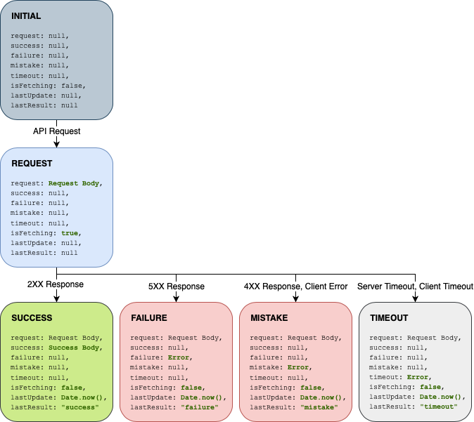

# Redux API State Caching Layer (RASCL)

The **Redux API State Caching Layer** (RASCL) is a [Flow](https://flow.org/) and [TypeScript](https://www.typescriptlang.org/) compatible pattern for API consumption. RASCL can be implemented without any of the code from this library, and this can be considered as more of a sample implementation.

The core principle for any RASCL implementation is the same: Redux actions, reducers, and sagas will be generated 1:1 from API calls. The current implementation in this repository produces Flow-typed actions (FSAs), API-calling sagas, and a reducer to handle them.

**Further reading:**

- [Flow](https://flow.org/)
- [TypeScript](https://www.typescriptlang.org/)
- [Flux Standard Action (FSA)](https://github.com/redux-utilities/flux-standard-action)
- [Redux](https://redux.js.org)
- [Redux-Actions](https://redux-actions.js.org)
- [Redux-Saga](https://redux-saga.js.org/)

## Motivations

### Reducing Boilerplate

Generally, any attempt to abstract API calls into a Redux "loop" while following "best practices" involves touching multiple files. Even using a library like `redux-actions`, convention might instruct a file heirarchy like

```
  redux
    ┣ actions
    ┃  ┣ index.js
    ┃  ┗ api.js
    ┣ sagas
    ┃  ┣ index.js
    ┃  ┗ api.js
    ┗ reducers
       ┣ index.js
       ┗ api.js
```

So to add a full "loop" for a new API call, `GET api/users/`, a developer would likely have to touch all six files. Furthermore, since most API calls are self-similar, it's a common source of copy-paste errors.

### Perfect Consistency

The most important contract in a RASCL implementation is that all API endpoint state information in the Redux store follows the exact same shape.

```js
// @flow

declare type ApiEndpointState = {|
  +request: mixed,
  +success: mixed,
  +failure: mixed,
  +mistake: mixed,
  +timeout: mixed,
  +isFetching: boolean,
  +lastUpdate: ?($Call<typeof Date.now> | number),
  +lastResult: ?EndpointState,
|}
```

The endpoint state itself is a [finite state machine](https://en.wikipedia.org/wiki/Finite-state_machine), and each action constitutes a transition according to its state class, which is one of `initial`, `request`, `success` `failure`, `timeout`, and `mistake`.

Each state class corresponds to a different transition, but the `success` `failure`, `timeout`, and `mistake` transitions share common elements - they all set the `isFetching` flag to `false`, they all update `lastUpdate` with the current value of `Date.now()`, and they set `lastResult` to their corresponding type value.



### Equal Access to Information

A common problem with storing API responses in Redux is that on large enough teams, different developers will implement storage according to their current focus.

In example, if a developer gets a ticket "As a user, I should see my name when I log in", they may implement a Redux loop that calls `GET user/profile` and has a handler in the reducer to store the user name, or maybe an action like `GET_USER_NAME` that only pulls the user name out of the response body.

The next developer gets a ticket, "As a user, I should see my profile picture when I log in". The URL for the profile picture comes back in the same `GET user/profile`, but now the second developer has to understand all of the decisions and data muxing done by the first developer, and will have to touch all the files outlined previously. After completion of the story, a full regression should probably be run because the data handling layer will necessarily have changed substantially.

In a RASCL implementation, the **entire** response body is stored in the `success` property of the state object for `getUserProfile` (or whatever our fictional API call is named). Developer one and two have equal and separate access to their required information, and are trivially able to write selector functions to access the state information they need.

### Simplifying Updates

**See [common patterns](docs/Common_Patterns.md) for more.**

Because all requests, responses, errors, and timestamps are stored, common patterns are much easier to manage, and only a single recipe needs to be written to handle a given scenario, which can then be applied to any RASCL state object representing an endpoint. The RASCL state object aims to be a lightweight and comprehensive way to store all data that could possibly be relevant to an API endpoint's "lifecycle".
